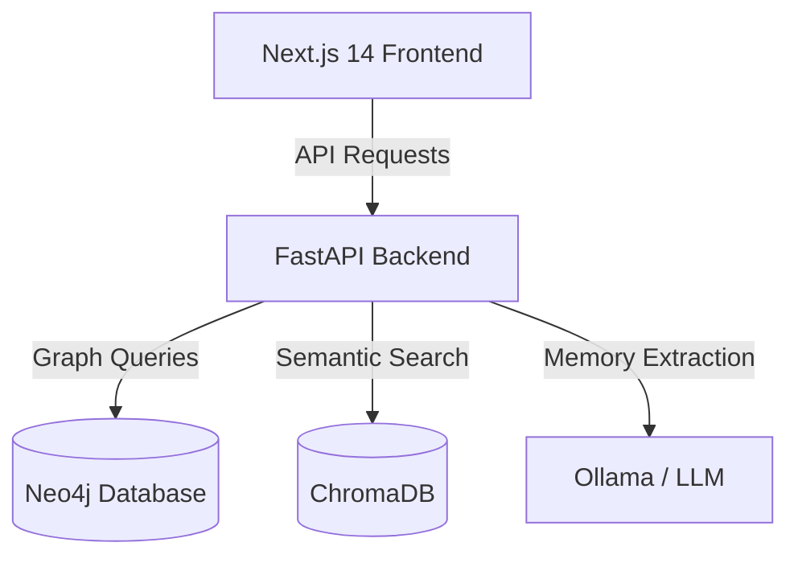

# IKnowYou 🧠

IKnowYou is a personal memory and relationship management system that helps you keep track of people you meet, their occupations, and how they relate to you. This repository is the IKnowYou monorepo, even if a few older prompts or artifacts still mention KinLedger.

## 🏗️ Architecture



## 📋 Prerequisites

Before you begin, ensure you have the following installed:
- **Node.js** (v18 or higher)
- **Python** (v3.9 or higher)
- **Docker & Docker Compose**
- **Ollama** (Running locally at http://localhost:11434)

## 🚀 Local Setup

### 1. Clone the Repository
```bash
git clone <repository-url>
cd IKnowYou
```

### 2. Infrastructure (Neo4j & Ollama)
Start the Neo4j database:
```bash
docker-compose up -d
```
*Accessible at http://localhost:7474 (default password: `kinledger123`)*

Ensure Ollama is running and has the required models:
```bash
ollama pull mistral
ollama pull nomic-embed-text
```

### 3. Backend Setup
```bash
cd backend
python -m venv venv

# Windows
.\venv\Scripts\activate
# Mac/Linux
source venv/bin/activate

pip install -r requirements.txt
copy .env.example .env
python -m uvicorn main:app --reload --host 0.0.0.0 --port 8000
```

### 4. Frontend Setup
```bash
cd ../frontend
npm install
npm run lint
npm run dev           # Starts on http://localhost:3000
```

Before starting the frontend locally, create its env file:
```bash
copy .env.example .env.local
```

## Docker Quick Start

From the repo root:
```bash
make start
```

Services:
- Frontend: http://localhost:3000
- Backend: http://localhost:8000
- Neo4j Browser: http://localhost:7474

## ✨ Key Features

### 🇮🇳 Indian Relationship Name Engine
A sophisticated system to resolve complex family paths into localized terms.
- **Tamil Support**: Mapping paths to terms like *Periyappa*, *Athai*, *Machan*.
- **Hindi Support**: Mapping paths to terms like *Tauji*, *Bua*, *Devar*.
- **Transliteration**: Provides both native script and phonetic English.

### 🔍 Conflict & Correction System
- **Real-time Detection**: Warns you if a new memory contradicts known relationships.
- **Correction Workflow**: Preview changes, see affected graph paths, and apply updates with a single click.

## 🛠️ Tech Stack
- **Frontend**: Next.js 14, Tailwind CSS, Lucide Icons, Shadcn/UI
- **Backend**: FastAPI, Pydantic, LangChain
- **Database**: Neo4j (Graph), ChromaDB (Vector Search), SQLite (Status tracking)
- **AI**: Ollama (Mistral & Nomic Embeddings)

## 📄 License
MIT
