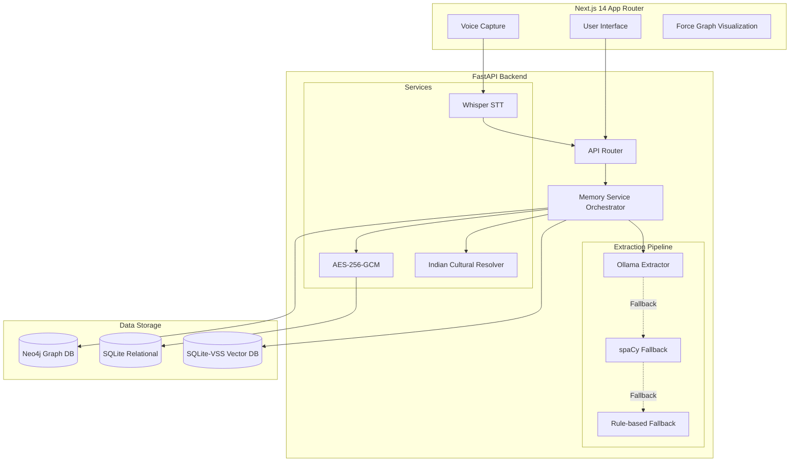

# IKnowYou 🧠

> **A Privacy-First, Fully Local Personal Relationship Memory System**

IKnowYou is a self-hosted, offline-first application designed to help you remember the humans in your life without sacrificing your privacy. It tracks people you meet, their relationships to you, and the memories associated with them—all visualized as an interactive knowledge graph. 

Because your relationships are deeply personal, **IKnowYou operates entirely on your local machine.** No cloud APIs, no data mining, and everything is encrypted at rest.

---

## ✨ Key Features

- **Fully Local & Private:** Zero external API calls. Everything runs on your machine.
- **Intelligent Memory Extraction:** Uses local LLMs via **Ollama** to automatically extract people and relationships from your journal entries or notes. Includes **spaCy** and rule-based fallbacks for lower-RAM systems.
- **Graph Knowledge Base:** Leverages **Neo4j** to build an interconnected web of your relationships, visualizing family trees, friend groups, and professional networks.
- **Semantic Vector Search:** Built-in **SQLite-VSS** allows you to search through your memories using natural language.
- **Voice Logging:** Talk to your journal! Integrated **Whisper STT** allows you to record voice notes which are transcribed entirely locally.
- **Indian Cultural Resolver:** Deep cultural awareness. The system understands complex Indian kinship terms (Tamil and Hindi) like *Amma*, *Chithappa*, *Dada*, and *Maami*, automatically mapping them to canonical relationship structures and generation deltas.
- **Encrypted at Rest:** All memory content is encrypted using **AES-256-GCM** before touching the disk.

---

## 🏗️ System Architecture

IKnowYou relies on a lightweight, modular architecture optimized for consumer hardware (runs on as little as 2GB RAM).



---

## 🚀 Setup & Installation

### Prerequisites
- **Python 3.11+** (using `uv` is recommended)
- **Node.js 18+** (using `pnpm` is recommended)
- **Docker** (for running Neo4j)
- **Ollama** installed locally (for LLM extraction)

### 1. Database Setup (Neo4j)
IKnowYou uses Neo4j to store the graph of your relationships. Start the database via Docker:
```bash
docker compose up -d neo4j
```

### 2. Pull Local AI Models
Ensure Ollama is running, then pull the necessary models for extraction:
```bash
ollama pull mistral:7b-instruct-q4_K_M
```

### 3. Backend Setup
Navigate to the backend directory, install dependencies, and start the FastAPI server:
```bash
cd backend

# Install dependencies using uv or pip
uv pip install -r pyproject.toml

# Start the server
uv run uvicorn app.main:app --reload --host 0.0.0.0 --port 8000
```
> The backend will automatically generate your AES-256-GCM encryption key on first run. Keep the `data/secret.key` file safe!

### 4. Frontend Setup
Navigate to the frontend directory and start the Next.js development server:
```bash
cd frontend

# Install dependencies
pnpm install

# Start the dev server
pnpm run dev
```
Visit **http://localhost:3000** in your browser.

---

## 📖 How It Works

### The Data Flow of a Memory
1. **Input**: You type a text note or record a voice memo via the frontend.
2. **Transcription (if audio)**: The audio is sent to the local Whisper model, transcribed, and the model is immediately unloaded to free up RAM.
3. **Extraction**: The text is passed to the Extraction Pipeline. Ollama attempts to parse the text into structured JSON identifying entities (people) and relationships. If Ollama is unavailable or fails, it falls back to spaCy or Regex rules.
4. **Cultural Resolution**: The `IndianRelationshipResolver` scans the extracted roles. If it detects a term like *"Anna"*, it maps it to `"elder_brother"`, flags the language as `"tamil"`, and determines the generation delta (`0`).
5. **Encryption & Storage**: 
    - The raw text is encrypted using AES-256-GCM and stored in standard SQLite.
    - An embedding vector is generated using `sentence-transformers` and stored in SQLite-VSS.
    - Nodes (People) and Edges (Relationships) are upserted into Neo4j.

---

## 🛠️ Tech Stack Deep Dive

| Component | Technology | Rationale |
|-----------|------------|-----------|
| **Frontend** | Next.js 14, TailwindCSS, `react-force-graph-2d` | Modern React patterns with excellent performance and easy 2D graph visualizations. |
| **Backend API** | FastAPI, Pydantic v2 | High-performance, async Python web framework with strict type validation. |
| **Graph Database** | Neo4j 5.x | Best-in-class for querying multi-hop relationship connections ("Who is my friend's brother?"). |
| **Vector & Relational DB** | SQLite + SQLite-VSS | Replaced ChromaDB to keep the footprint incredibly lightweight and consolidated into a single `.db` file. |
| **AI Extraction** | Ollama (Mistral 7B) | Local, uncensored LLM extraction ensuring zero data leaves your device. |
| **NLP Fallback** | spaCy (`en_core_web_sm`) | A ~50MB deterministic NLP fallback when RAM is too low to run Ollama. |
| **Speech-to-Text** | OpenAI Whisper (Local) | Handles voice notes beautifully, including code-switching (e.g., Hinglish/Tanglish). |
| **Encryption** | Cryptography (AES-GCM) | Industry-standard authenticated encryption for absolute privacy. |

---

## 📄 License
MIT License - Feel free to hack, modify, and build upon this to take back ownership of your digital memory.
